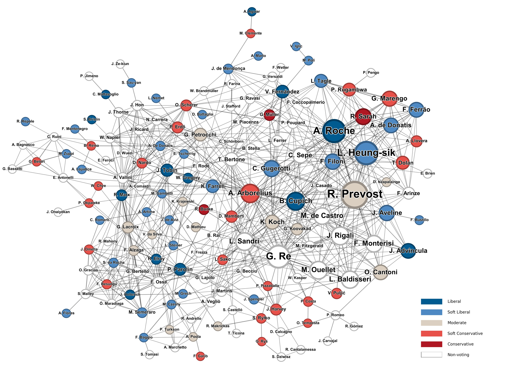

## 本周行业资讯

- 《Bocconi University｜In the Network of the Conclave》：<a href="https://www.unibocconi.it/en/news/network-conclave">https://www.unibocconi.it/en/news/network-conclave</a>

  > [!Info]+ 推荐语
  > 【重磅推荐】《意大利博科尼大学｜教宗选举秘密会议的社会网络何以揭秘天机》 。留意，该研究在教宗选举前已发布。新当选第267任教宗的良十四世（本名Robert Prevost）为该研究预测胜选的头号候选人。
  >
  > 导读：网络科学能否揭示教宗选举的幕后逻辑？意大利学者通过构建枢机主教的“权力关系网络”，发现地位权重、信息枢纽与联盟构建三大要素深刻影响着下一任教皇的诞生。研究团队整合了官方职务关联、祝圣谱系传承及非正式派系纽带三类数据源，首次绘制出包含300余名枢机主教的多维关系图谱。分析显示，“地位权重”突出者如美国的罗伯特·普雷沃斯特（Robert Prevost），因与核心圈层高频互动占据高位；“信息枢纽”佼佼者如瑞典的安德斯·阿博雷柳斯，凭借跨派系沟通能力成为决策桥梁；而菲律宾的路易斯·安东尼奥·塔格莱则以卓越的联盟构建能力位居前列。值得注意的是，模型特别纳入年龄修正参数，以反映历史上对“中龄候选人”的偏好。这项开创性研究揭示了隐藏在神圣仪式背后的人际政治学。

- 《北大文研院｜阅读、知识和社会学的未来——安德鲁·阿伯特访谈》：<a href="https://mp.weixin.qq.com/s/CrgcaulAwM8XWetdDszpaw">https://mp.weixin.qq.com/s/CrgcaulAwM8XWetdDszpaw</a>

<!--more-->

- 《人物｜名校毕业后，我陪伴了150位休学少年》：<a href="https://mp.weixin.qq.com/s/MjQoYA4jcdAHEMkDbUInbA">https://mp.weixin.qq.com/s/MjQoYA4jcdAHEMkDbUInbA</a>

- 《叁零柒计划｜教培行业，本就不该存在》 ：<a href="https://mp.weixin.qq.com/s/5jOpO191rE8rZtk-StIz5w">https://mp.weixin.qq.com/s/5jOpO191rE8rZtk-StIz5w</a>

- 《包寒吴霜｜浅谈「相关、预测、影响、因果」》：<a href="https://zhuanlan.zhihu.com/p/481022419">https://zhuanlan.zhihu.com/p/481022419</a>

## 本周学术资讯

- Battisti, M., Lavezzi, A. M., & Musotto, R. (2025). Hierarchy, Tasks, Space: An analysis of tie formation in the Palermo Mafia. Social Networks, 82, 213-228. <a href="https://doi.org/10.1016/j.socnet.2025.04.002">https://doi.org/10.1016/j.socnet.2025.04.002</a>

  > [!Info]+ 导读
  > 西西里黑手党是如何管理组织的？这项研究基于2008年“帕尔马行动”（Operazione Perseo）中被捕的97名黑手党成员数据，运用社会网络分析法揭示了Cosa Nostra这一古老犯罪组织的网络构建逻辑。关于层级结构，研究发现黑手党高层之间存在矛盾效应：一方面，他们的领导地位（如协调争议、掌握机密信息）促使跨层级联系形成；另一方面，为避免暴露核心信息，他们主动减少与其他高层的直接互动。这种既协作又疏离的动态，恰如企业CEO既需要战略沟通又需防范信息泄露。论文还发现，负责联络其他家族、干预公共工程招标等公共事务等组织性任务的成员，他们更容易达成跨辖区合作；而负责勒索保护费、贩毒等犯罪行动则依赖垂直指令。并且，黑手党在地理上的“辖区”成为信任基础单元，即便邻近若分属不同辖区，其成员间也难建立联系。整体而言，研究揭示了诸如黑手党这样的传统犯罪组织，是如何通过制度设计平衡地方自治与整体控制，构成一种独特的“生存智慧”。

- Mathurin, G., Lam, L., Al-Alaoui, S., & Triandafyllidou, A. (2025). A Fine Balance: Exploring Job Quality in Platform Work Between Migrants and Nonmigrants. International Migration Review, <a href="https://doi.org/10.1016/j.socscimed.2025.118131">https://doi.org/10.1016/j.socscimed.2025.118131</a>

  > [!Info]+ 导读
  > 移民与非移民群体对平台工作质量是否存在差异化认知？这项研究通过加拿大62份深度访谈数据，发现移民的“身份状态”和“迁移时长”系统性地重构了其对平台工作满意度的权重分配。具体而言，近期移民（0-5年）往往被迫优先满足生存性需求，他们看重平台工作即时收入的“应急价值”，却不得不接受职业稳定性和心理归属感的缺失；定居移民（5年以上）则在算法控制与自主性之间寻找平衡点，既利用平台补充收入，又持续遭遇临时居留导致的“伪自主困境”；而非移民群体则将平台视为职业发展的“跃迁工具”，既能灵活选择工作时段，也能在收益下降时果断退出。

- Wang, M., Sun, T., & Liu, X. (2025). Peace or menace? Robots and social conflict. China Economic Review, 102439, 102439. https://doi.org/10.1016/j.chieco.2025.102439

  > [!Info]+ 导读
  > 工业机器人是威胁社会稳定还是带来和平？这篇论文基于中国2011-2019年城市社会冲突数据和中国家庭追逐调查数据，检验机器人渗透率与社会冲突的关系。研究结果显示机器人应用每增长1单位，社会冲突发生率下降约15%。这一效应通过双重机制实现：工作压力缓解（机器人承担重复劳动后，劳动者周工时减少、健康状况改善）和情绪优化（工作满意度提升、孤独感下降）。研究进一步揭示，制造业和教育行业冲突减少最明显，私企与外企的劳资矛盾显著弱化，而国企改革滞后导致冲突抑制不显著；机器人能有效遏制罢工和抗议，但对自杀威胁等极端行为无影响。该研究首次系统论证技术变革的社会稳定效应，反驳了“机器人威胁论”中“失业灾难”的预测。

- Zha, F., & Zhou, D. (2025). The long-term effect of television on children’s human capital development in China. Journal of Development Economics, 103538, 103538. https://doi.org/10.1016/j.jdeveco.2025.103538

  > [!Info]+ 导读
  > 中国儿童频道（CCTV-14）的开播对儿童人力资本发展有何长期影响？这篇论文基于中国家庭追踪调查2010年数据，利用2003年CCTV-14开播时城乡电视信号覆盖的时间差异，采用双重差分模型（DID）分析早期电视教育的人力资本效应。结果显示，CCTV-14显著提升了非认知技能（如情绪稳定性和责任感），其人格特质得分在成年后提高至少9.92%，这一效果在留守儿童群体中尤为突出：当父母缺席4-12岁发展阶段时，电视教育的补偿作用改善了儿童的情感与责任认知；而在0-3岁父母缺席的早期阶段，补偿效应更显著。分析表明，CCTV-14通过播放高质量动画传递勇气、合作等价值观，替代了农村留守儿童缺失的家庭情感陪伴，且该机制未通过学校教育实现，而是依赖于非正式的家庭外社会情感输入。

- Xiao, Z., Xie, Z., Wang, G., Zhang, Z., Zhu, L., Liu, Y., & Zhou, D. (2025). Resilience of power systems under the impact of disasters: A case study of 108 earthquakes in China over the past six years. Cities, 163(106001), 106001. https://doi.org/10.1016/j.cities.2025.106001

  > [!Info]+ 导读
  > 中国的电力系统的抗压水平如何？这篇论文基于2018-2023年中国45个城市经历的108次地震数据，构建了电力系统抗震韧性评估模型，系统揭示了城市电力系统在设施、环境、组织、经济、社会五维韧性上的显著差异。研究发现，成都因电网密度高、科技投入大而韧性最优，昌都受地形恶劣与防灾投入不足影响韧性最低，青藏地区整体表现薄弱，而唐山、雅安等北方及地震频发城市韧性相对较高。E-PRI模型通过CRITIC-EWM算法赋权，结合地震强度-距离公式与夜间灯光遥感数据验证，显示环境维度对设施抗毁能力影响最大，社会维度因教育水平与公众参与度不足成为普遍短板。
